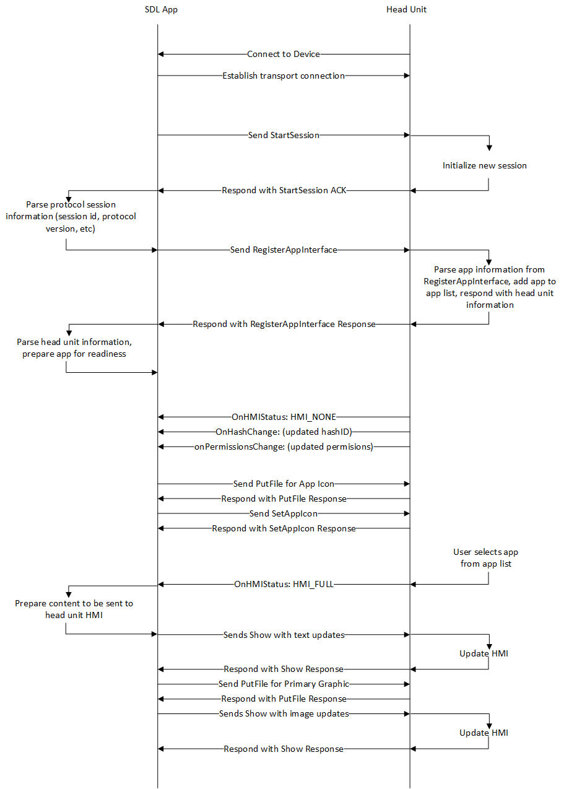

# Activating the App

At this point, the app should have started its SDL protocol session, registered through the RPC service, and be displayed in some sort of app list. The next step is to activate the app by selecting it from the list. This will inform the app that their HMI status has changed to one that is visible, and the app will start to send all its content to the head unit. 

This content will include setting their layout template, and sending default text and images to display. They also have the opportunity to build out their menus and submenus. If the head unit supports voice recognition, the app will send over its VR synonyms for voice commands. 

 
