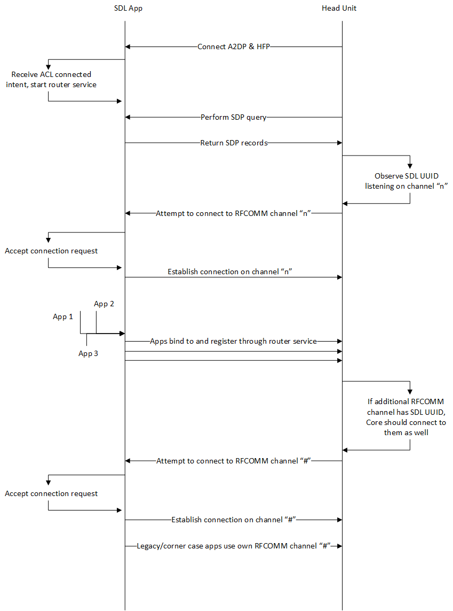
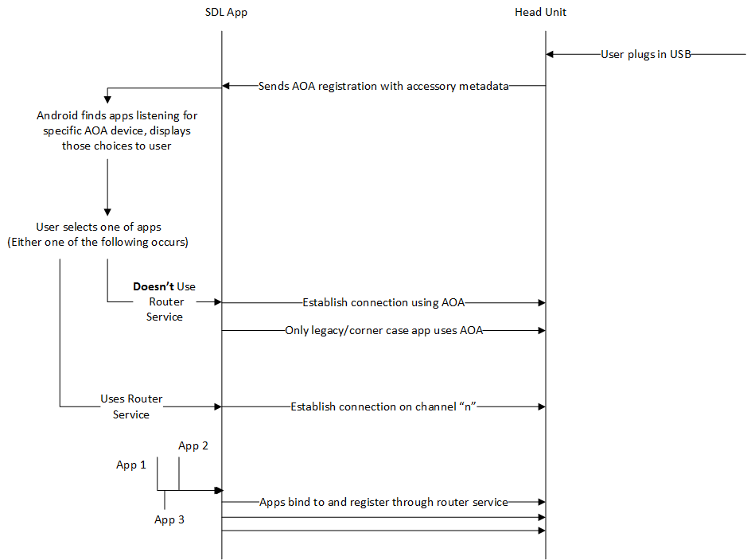
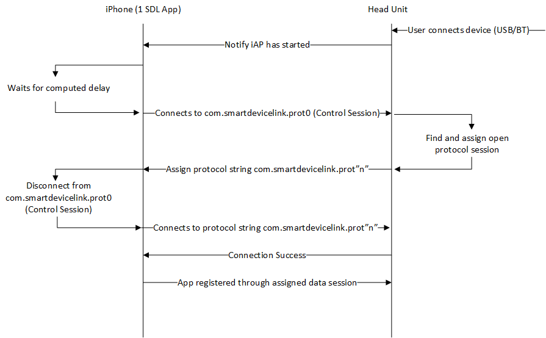
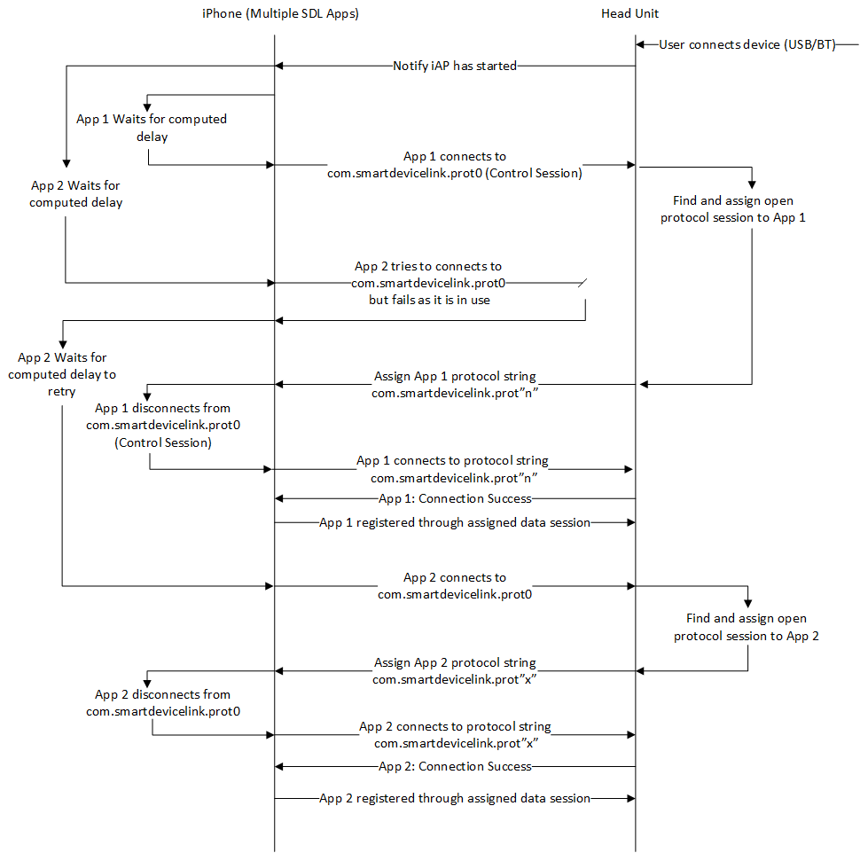
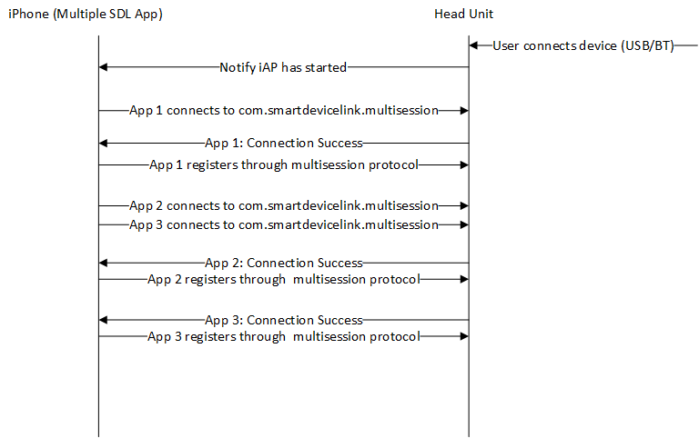

## Transports and establishing a connection

SDL is transport agnostic, meaning it can work over any potential transport. The important note here is that the projects themselves connect in a specific ways over certain transports. 

The first step in using SDL is to establish a connection over a primary transport.

 

##### Primary vs Secondary Transports

SDL has the ability to register a session across multiple transports. This is useful for different scenarios where a higher bandwidth transport is needed to perform more data intensive operations of SDL (video/audio streaming).  

### Android

#### Bluetooth
- Primary or secondary

Bluetooth connections established to an Android device require a few prerequisites and processes. First, the bluetooth's Advanced Audio Distribution Profile (A2DP) and Hands Free Profile (HFP) must be connected for the SDL Android router service to start listening on an RFCOMM channel using the Serial Port Profile (SPP). The Android device will use a router service that allows multiple apps to bind to it and utilize a single transport connection. This allows for a greater chance that the SDL library can obtain one of the RFCOMM channels available on the device, as most devices have rather low limits. In some cases, apps might not bind to the router service and listen on their own bluetooth transport. These apps must also be connected.

 

##### Additional Notes

- After the initial connection of A2DP and HFP, the head unit will only have a limited time to connect to the SDL RFCOMM channel. This is due to several Android operating system restrictions and requirements.
- In most cases, the first SDP query will only return a single RFCOMM channel for the SDL UUID, this is the router service listening. After connecting to that RFCOMM channel it is recommended to do another SDP query. This is due to some apps not trusted the previously connected router service, and they will start their own bluetooth transport with a different RFCOMM channel but still use the SDL UUID. The head unit should connect to each additional RFCOMM channel with the SDL UUID.
- Due to the previous bullet along with other situations (ie apps crashing), it is also recommend an SDP query be triggered at some other point. Common triggers are user requested button presses, transport disconnection, or app unregistration.

#### USB
Primary or secondary

Android has a specification called AOA that allows apps to communicate over a USB connection. The default implementation of AOA on the Android device is actually very limited. Users must select an app to receive the "USB device" upon connection. However, the SDL Android library leverages its already existing functionality of multiplexing a single transport connection through a router service to allow multiple apps to use the AOA connection. 

 

#### TCP
-  Secondary

Due to limitations for the iOS platform (discussed in the next section), Android can only use the TCP transport as a secondary transport in production. 

### iOS

#### Bluetooth and USB
- Primary or secondary

Apple has a proprietary technology that apps connect through to communicate any sort of data over bluetooth or USB. Unfortunately this means that none of that information can be shared here. Both of those transports will have to integrate with that technology according to the Apple specifications. For more information see [here](https://developer.apple.com/programs/mfi/).

##### Single vs Multisession Protocol

The way IAP works is that you have a protocol string that a hardware device and an app declare that they can use. When iOS sees a hardware device with a known protocol string, it notifies the app. The app can open a 1-1 connection with the hardware using that protocol string as an identifier for the connection. 

###### Single session protocol

There are two different connection strategies that the iOS library uses. The first is the hub strategy for connecting to single session iAP protocol. This method is only included in the library as legacy support and should not be implemented in new modules. The hub strategy was developed to allow multiple apps to connect to the hardware. The hardware has 30 protocol strings available. Each app will attempt to connect to one protocol (prot0, called the control protocol) in order to receive one byte of data. That data is a number 1-29. The app will then disconnect from the control protocol and connect to a data protocol corresponding to the number they received (prot1-prot29). The app is given a timeout based on a hash of the app’s name. So the apps will try to connect to the control string after that timeout. If they fail, they’ll wait the timeout 3 more times and attempt to connect to get their data protocol number.

 

This strategy works, but has some very large downsides. As more apps try to connect to the control protocol it is near at random chance what the app's delay threshold is set to and if there will be any collision connection attempts to the necessary control protocol prot0.

 

###### Multisession protocol

Multisession is a newer iAP feature that basically just allows multiple connections to a single protocol string. So every app can connect to the multisession protocol string without needing to wait and trying to manage connection timing to the single control string that only allows one connection at a time. This is the preferred method to connect to SDL applications as it eliminates a lot of the stability issues that have been observed with the single session method.  See [this evolution proposal](https://github.com/smartdevicelink/sdl_evolution/blob/master/proposals/0080-Support-for-MultiSession-protocol-string.md) for its acceptance into the project.

 

#### TCP
- Secondary

iOS has a very strict limitation that no TCP connection can be maintained while an app is in the background. For this reason TCP can only be a secondary transport.

### Java SE

#### Websocket Server
- Primary

The only transport currently available by default form the SDL Java SE library is a web socket server connection. The Java SE app is usually destined to run directly on the same device as the SDL Core and HMI. Determining when the Java SE app should start listening to that web socket port will need to be defined by the SDL Core integrator. This will likely be during start up of the device, the Java SE app can simply be started and wait for the user to select the application from the application list. 

### Java EE

#### Java Beans (Custom Transport)
- Primary 

Java EE is usually built around Java Beans in order to easily handle a lot of simultaneous connections that each have their own, independent state. This is another example of a proprietary or specifically licensed transport. Because of this, the Java EE library has what's called a Custom Transport. This also developers to hook into the Java EE Bean framework without the SDL library having to include that code into the library itself. 
Java EE apps are designed to be long running applications that live on an off-board server. The SDL Core implementation will connect out to these applications once they are selected from the app list on the HMI. 
