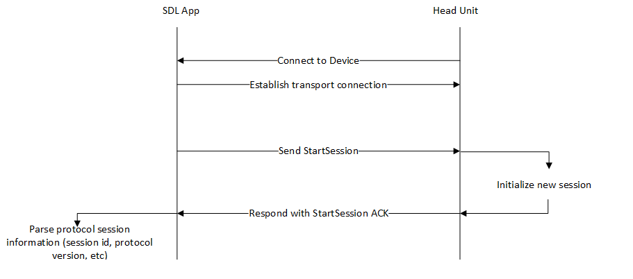

## Starting an SDL Session

The [Protocol Spec](../../protocol-spec) defines the lowest SDL layer, and one of the first items that is required to connect an app is start an SDL Session. This includes starting the base RPC and Hybrid services – which are types of data sent using SDL that can be turned on and off – using the Control service which is always available.

The first packet sent is from the app library to the SDL Core implementation. This is a `StartService` control frame message. This packet is very basic and contains only a small amount of information about the app that is connecting and is intended to start the protocol session that all other SDL layers are built on top of. See the [protocol spec for more information](../../protocol-spec).

The Core implementation should respond with a `StartServiceACK` that contains specific information as described in the protocol spec. After this moment, the SDL session has been defined and started for an app.

 

### When is Streaming Allowed

SDL Core maintains which apps can stream audio or video via the `audioStreamingState` and `videoStreamingState` parameters of `OnHMIStatus`. In order for an app to stream it must be in `STREAMABLE` `videoStreamingState` or `AUDIBLE`/`ATTENUATED` `audioStreamingState`. SDL Core knows whether the app uses video service or not depending on the `AppHMIType`. Currently only `NAVIGATION` and `PROJECTION` apps use video service. Assuming there is at most one app that can do video streaming at any time, the following table shows how SDL Core shall act regarding `videoStreamingState` in different cases:

| Case | Current video source | SDL app2 comes to FULL | Results | OnHMIStatus videoStreamingState to app1 | OnHMIStatus videoStreamingState to app2 | 
| -- | --- | --- | --- | --- | --- |
| 1 | NONE | app2 does not use video | no app is the video source | NA | NOT_STREAMABLE|
| 2 | NONE | app2 uses video | app2 is the video source | NA | STREAMABLE|
| 3 | app1 | app2 does not use video | app1 is **still** the video source | No Change | NOT_STREAMABLE|
| 4 | app1 | app2 uses video | app2 is the **new** video source | NOT_STREAMABLE | STREAMABLE|
| 5 | app1 | CarPlay/Android Auto is the active screen | no SDL app is the video source | NOT_STREAMABLE | NA|

!!! NOTE
If an app does not stop video service after receiving `onHMIStatus` with `videoStreamingState`=`NOT_STREAMABLE` for some time, SDL Core shall send a stop service control frame to the app.
!!!

The bool parameter `isMediaApplication` in the register app interface request indicates if an application supports the `AUDIBLE` streaming state. There are two types of projection applications; if AppHMIType=PROJECTION and isMediaApplication=false, we call it a non-media projection application. If AppHMIType=PROJECTION and isMediaApplication=true or AppHMIType=PROJECTION & MEDIA, we call it a media projection application. We assume that media projection applications stream audio data via either Bluetooth A2DP (for android) or iAP (for iOS) as regular media applications do. We also assume projection applications do not use binary audio service. The following table shows how SDL Core shall act regarding `audioStreamingState` in different cases.

| Case | Current audio source (appHMIType) | SDL app2 activated or system event | app2 appHMIType | app2 is media | Results | OnHMIStatus audioStreamingState to app1 | OnHMIStatus audioStreamingState to App2 |
| --- | --- | --- | --- | --- | --- | --- | --- |
| 1 | none | app2 does not use audio | any | false | no app is the audio source | NA | NOT_AUDIBLE |
| 2.1 | none | app2 uses audio | NAVIGATION | false | app2 is the audio source | NA | AUDIBLE |
| 2.2 | none | app2 uses audio | any | true | app2 is the audio source | NA | AUDIBLE |
| 3 | app1 (any) | app2 does not use audio | any | false | app1 is the audio source | No Change | NOT_AUDIBLE |
| 4.1 | app1 (NAVIGATION or COMMUNICATION) | app2 uses audio | same as app1 | false | app2 is the audio source | NOT_AUDIBLE | AUDIBLE |
| 4.2 | app1 (NAVIGATION or COMMUNICATION) | app2 uses audio | others | true | app1 and app2 are the audio sources | AUDIBLE | AUDIBLE / ATTENTUATED or NOT_AUDIBLE * |
| 4.3 | app1 (Non-NAVIGATION, NON-COMMUNICATION) | app2 uses audio | NAVIGATION or COMMUNICATION | false | app1 and app2 are the audio sources | AUDIBLE / ATTENTUATED or NOT_AUDIBLE * | AUDIBLE |
| 4.4 | app1 (Non-NAVIGATION, NON-COMMUNICATION) | app2 uses audio | others | true | app2 is the audio source | NOT_AUDIBLE | AUDIBLE |
| 5.1 | app1 (any) | PHONE_CALL / EMERGENCY_EVENT / AUDIO_SOURCE / EMBEDDED_NAVI | NA | NA | app1 is not the audio source, system set the audio source | NOT_AUDIBLE | NA |
| 5.2 | app1 (any) | TTS Start | NA | NA | depending on mixing audio support, app1 can be audio source | NOT_AUDIBLE / ATTENUATED | NA |
| 5.3 | app1 (any) | CarPlay/Android Auto is the active screen (DEACTIVATE_HMI) | NA | NA | no SDL app is the video source | NOT_AUDIBLE | NA |

 *In the case of co-existence of a NAVIGATION app and a MEDIA or COMMUNICATION app, when the NAVIGATION app does not start audio steaming service, the MEDIA/COMMUNICATION app is `AUDIBLE`; When the NAVIGATION app starts audio streaming service, the MEDIA/COMMUNICATION app is either `ATTENUATED` if the system supports mixing or `NOT_AUDIBLE` if the system does not support mixing.

!!! NOTE
The transition of `videoStreamingState` and `audioStreamingState` is independent of the transition of `hmiLevel`. However, the transition of `hmiLevel` depends on both `audioStreamingState` and `videoStreamingState`. SDL Core shall move a `LIMITED` level media/projection/navigation app which is `NOT_AUDIBLE` and `NOT_STREAMABLE` to `BACKGROUND` HMI level. There are at most two media/projection/navigation apps which can be placed in HMI level `LIMITED`. In `LIMITED` level, an app can be either `AUDIBLE` (including `ATTENTUATED`) or `STREAMABLE` or both.
!!!