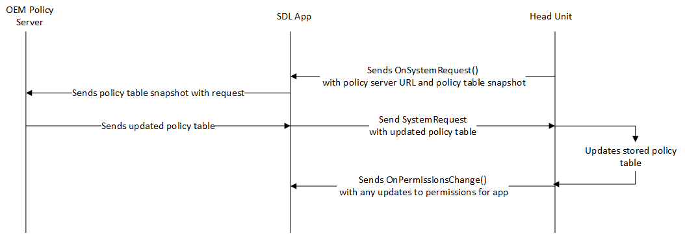

# Policies

SmartDeviceLink uses a robust message checking system that allows OEMs to control exactly what information and RPCs can be sent to and from any connected app. This allows the OEM to be in control of the user's data and make the choices of which apps get access to it. The central feature of policies is to disallow certain RPC requests from the application when they are not permitted while also allowing other apps to use those RPCs. It can also be as granular as specifying which parameters can be accepted for messages, and as broad as disallowing an app from registering in the first place. This is very useful when sensitive data like vehicle data is involved because policies can specify exactly which data sets (RPM, PRNDL, etc) apps can access.

Why is this type of control useful? Let's examine an app's ability to use the `Alert` RPC. Often an OEM will wish to choose which apps have the ability to show an Alert overlay on screen while the app is in the background or when the app has not been activated by the user.

While this could be a simple check hardcoded into Core that disallowed all apps from showing Alerts while backgrounded, it may also make sense that some apps are allowed to do so. By creating different functional groups and assigning those to specific apps, Core can have dynamic behavior for each app. 

## Common Use Cases for Policies

- Permitting and denying access to vehicle data.
- Permitting and denying access to remote control of vehicle features like the climate system.
- Adjusting the number of messages that the app can send before it is activated.
- Adjusting the default HMI status for apps after registration.
- Including SDL related strings and translations that will be displayed to the user.

## Policy Table Updates

Beyond simply just hardcoding behaviors, it is also not expected that the app specific behaviors be static as well. Policy tables are made to be updated. This process can happen a few different ways, but the most common is leveraging the connected application to retrieve and pass the policy table. 

SDL provides an [example policy server](https://smartdevicelink.com/en/guides/sdl-server/overview/) that can dynamically build and serve these policies to head units in order to update a head unit's policies dynamically. We strongly recommend that OEMs support policy table updates using a policy server so that apps which become available after a head unit ships can have specialized policies.

 

#### Policy Update Triggers

Some events will trigger Core to request an updated policy table. Here are a few:

- A new and unrecognized app connects.
- After a set expiration date.
- "x" number of ignition cycles have happened.

